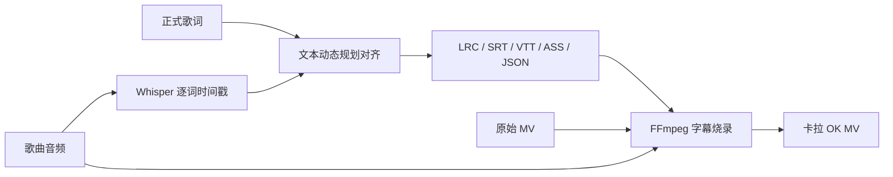

# Karaoke Forge

把一首歌、对应歌词和 MV 变成带逐词高亮的卡拉 OK 视频。所有处理都可以在本地完成，音频和视频不会被上传到第三方服务。

[English](README_EN.md) · [更新记录](CHANGELOG.md) · [待办事项](TODO.md) · [贡献指南](CONTRIBUTING.md) ·
[问题反馈](https://github.com/cf2xh123/karaoke-forge/issues)

> 当前版本：`0.2.0`（Alpha）。建议先用一首 1～2 分钟的歌曲试跑并检查时间轴，再处理正式 MV。

## 能做什么

- 根据歌曲音频给无时间轴歌词生成逐词时间戳；
- 保留用户提供的正式歌词，用 Whisper 结果定位，不会直接用识别文本替换歌词；
- 读取 TXT、LRC、增强 LRC、SRT、VTT、ASS 和项目 JSON；
- 导出 LRC、增强 LRC、SRT、VTT、逐词高亮 ASS 和 JSON；
- 把字幕烧录进 MV，并可用高质量歌曲音轨替换 MV 原音轨；
- 自动定位 MV 中歌曲真正开始的位置，跳过片头或片尾剧情；
- 优先采用网易云 YRC 真实逐字时间，并可根据演唱速度精修普通行级歌词；
- 显示顶部中文翻译和左上、右下交替的传统 KTV 双行歌词；
- 为日语汉字添加振假名、为英文单词添加片假名读音；
- 在网页中实时预览字幕字体、字号、颜色和布局；
- 可选用 Demucs 先分离人声，改善复杂伴奏中的识别效果；
- Windows、macOS、Linux 均可使用。

## 工作流程



Whisper 只负责找出“唱到什么位置”；最终画面仍使用你提供的歌词。对齐算法的说明见 [docs/algorithm.md](docs/algorithm.md)。

## 环境要求

- Python 3.10 或更高版本；
- [FFmpeg](https://ffmpeg.org/download.html)，并确保终端中可以运行 `ffmpeg -version`；
- 生成时间轴需要 [faster-whisper](https://github.com/SYSTRAN/faster-whisper)；
- 可选的人声分离使用 [Demucs](https://github.com/facebookresearch/demucs)。上游项目目前只做有限维护，因此它不是默认依赖。

## 不会命令行？使用网页版

Windows 用户可以完全通过双击操作：

1. 第一次使用时双击项目根目录的 **`首次安装.bat`**；
2. 安装完成后双击 **`启动网页版.bat`**；
3. 浏览器会自动打开本地工作台；
4. 上传歌曲、MV 和歌词，选择颜色后点击“开始生成”。

网页包含五个功能区：

- **制作卡拉 OK MV**：自动定位 MV 中歌曲开始位置，一次完成歌词对齐、格式导出和视频生成；
- **只生成时间轴歌词**：输出 LRC、增强 LRC、SRT、VTT、ASS 和 JSON；
- **网易云链接生成歌词**：解析原文/中文翻译 LRC，可配合本地会员音频；
- **歌词格式转换**：已有时间轴歌词无需 AI 模型即可转换；
- **环境检查与帮助**：查看 FFmpeg、Whisper 和可选人声分离是否就绪。

素材只会传给本机上的网页服务，默认不会发送到公网。输出保存在项目的 `outputs` 目录。

macOS/Linux 或希望手动启动的用户：

```bash
pip install -e ".[web,align,netease,pronunciation]"
karaoke-forge web
```

## 安装

克隆项目后，在项目目录创建虚拟环境：

```bash
python -m venv .venv
```

Windows PowerShell：

```powershell
.\.venv\Scripts\Activate.ps1
python -m pip install --upgrade pip
pip install -e ".[align]"
```

macOS / Linux：

```bash
source .venv/bin/activate
python -m pip install --upgrade pip
pip install -e ".[align]"
```

如需人声分离：

```bash
pip install -e ".[all]"
```

如需同时安装本地网页和自动对齐：

```bash
pip install -e ".[web,align,netease,pronunciation]"
```

安装后检查运行环境：

```bash
karaoke-forge doctor
```

## 最快用法

准备三个文件：

- `song.flac`：正式歌曲音频，WAV/FLAC/MP3/M4A 等 FFmpeg 可读格式均可；
- `mv.mp4`：对应版本的 MV；
- `lyrics.txt`：按演唱顺序排列、一行一句的歌词。

然后运行：

```bash
karaoke-forge make song.flac mv.mp4 lyrics.txt \
  -o output/song-karaoke.mp4 \
  --language zh
```

Windows PowerShell 可写成一行：

```powershell
karaoke-forge make song.flac mv.mp4 lyrics.txt -o output/song-karaoke.mp4 --language zh
```

## 网易云单曲链接

网页版的“一键制作 MV”支持用网易云链接补充素材：

- 已上传本地音频时，只读取公开的歌曲信息和 LRC，不请求网易云音频；
- 没有本地音频时，默认只尝试获取匿名用户也能公开播放的音频；
- 平台只返回 30 秒试听、但上传的 MV 带完整音轨时，会自动改用 MV 内嵌音频；
- 选择本机已登录的 Chrome、Edge、Firefox 或 Brave 后，会检测登录状态和该歌曲
  实际返回的 VIP/SVIP 音质权限，并获取账号有权播放的最高音质；
- 没有上传歌词时，可以直接采用网易云页面原文和中文翻译 LRC；
- 自己上传或粘贴的歌词始终优先于页面歌词。

会员歌曲可以在网页中选择已登录网易云的浏览器，也可以在网易云官方客户端中按平台
许可导出标准 MP3、FLAC、WAV 或 M4A 后上传。本项目：

- 不接收账号或密码；浏览器 Cookie 只在本机内存中按需读取，不写入项目或输出目录；
- 只使用当前账号本来具有的播放和音质权限，不提升或模拟会员身份；
- 不绕过地区、版权或 DRM 限制；
- 不转换或解密 `.ncm` 文件。

只生成时间轴歌词时，可以使用网页的“网易云链接生成歌词”，也可以运行：

```bash
karaoke-forge netease "https://music.163.com/song?id=123456" lyrics.txt \
  --cookies-from-browser edge \
  --i-have-rights \
  -o build/netease
```

浏览器中需要已经登录 `music.163.com`；非默认配置可加
`--browser-profile "Profile 1"`。程序会记录检测到的登录状态、该曲最高可用音质以及
VIP/SVIP 权限，但不会打印或保存 Cookie。省略 `lyrics.txt` 会优先使用页面公开的 YRC
逐字时间歌词，没有 YRC 时再回退到 LRC；
同时省略 `--audio` 和 `--cookies-from-browser` 时会尝试匿名公开音频。
YRC 中每个字的真实开始时间和持续时间会直接用于扫色，能处理拖长音、抢拍和句中速度
变化。普通 LRC/SRT 只有行级时间时，默认用音频识别结果精修句内逐字时间，同时固定原有
行首和行尾，避免整句漂移；可用 `--no-refine-word-timing` 关闭。网页“高级选项”中也有
对应开关。

制作 MV 时默认启用音轨指纹匹配。它从歌曲和 MV 内嵌音轨提取多个短窗口，只有多个
窗口以同一偏移量稳定匹配时才接受结果，因此可以跳过片头/片尾剧情，也能阻止错误歌曲
和错误 MV 继续生成。命令行使用 `karaoke-forge make ... --auto-sync` 开启。

输出包括：

```text
output/
├── song-karaoke.mp4
└── song-karaoke.assets/
    ├── song-karaoke.lrc
    ├── song-karaoke.enhanced.lrc
    ├── song-karaoke.srt
    ├── song-karaoke.vtt
    ├── song-karaoke.ass
    └── song-karaoke.json
```

第一次运行会下载所选 Whisper 模型。默认模型是 `small`，速度、显存和准确率比较均衡。

## 分步使用

### 1. 只生成时间轴歌词

```bash
karaoke-forge align song.flac lyrics.txt \
  -o build/song \
  --language zh \
  --model small
```

伴奏很密、识别覆盖率较低时，可以先分离人声：

```bash
karaoke-forge align song.flac lyrics.txt \
  -o build/song \
  --language zh \
  --separate-vocals
```

CPU 可尝试：

```bash
karaoke-forge align song.flac lyrics.txt \
  -o build/song \
  --device cpu \
  --compute-type int8
```

NVIDIA GPU 可尝试：

```bash
karaoke-forge align song.flac lyrics.txt \
  -o build/song \
  --device cuda \
  --compute-type float16 \
  --model medium
```

### 2. 把已有时间轴歌词转换格式

```bash
karaoke-forge convert lyrics.lrc -o lyrics.srt
karaoke-forge convert lyrics.srt -o lyrics.ass
karaoke-forge convert lyrics.json -o lyrics.enhanced.lrc --format elrc
```

### 3. 把字幕烧录进 MV

保留 MV 自带音轨：

```bash
karaoke-forge render mv.mp4 lyrics.ass -o karaoke.mp4
```

替换为正式歌曲音轨：

```bash
karaoke-forge render mv.mp4 lyrics.ass \
  --audio song.flac \
  -o karaoke.mp4
```

如果歌曲音轨比 MV 画面晚 0.35 秒开始：

```bash
karaoke-forge render mv.mp4 lyrics.ass \
  --audio song.flac \
  --audio-offset 0.35 \
  -o karaoke.mp4
```

负数会让歌曲音轨提前。输出已存在时需明确传入 `--overwrite`。

## 字幕样式

`align`、`render` 和 `make` 都支持同一组样式参数：

```bash
karaoke-forge make song.flac mv.mp4 lyrics.txt \
  -o karaoke.mp4 \
  --auto-sync \
  --font "Noto Sans CJK SC" \
  --font-size 64 \
  --text-color "#FFFFFF" \
  --highlight-color "#FFD54A" \
  --outline-color "#111111" \
  --margin-v 80 \
  --translation-font-size 38 \
  --translation-color "#EAF4FF" \
  --pronunciation-font-size 26 \
  --pronunciation-color "#FFFFFF" \
  --resolution 1920x1080
```

当歌词包含中文翻译时，ASS 会采用传统 KTV 分区布局：中文翻译固定在画面顶部居中，
原文在底部按“左上行 + 右下行”成对显示，当前句逐字变色，另一句保持未唱颜色。
可用 `--no-show-translation` 关闭翻译。网页版样式区域提供 16:9 实时字幕预览，
字体、字号、颜色、翻译和底部位置都会立即反映在预览画面中。

默认还会为含汉字的日语歌词生成平假名振假名，并为英语单词生成片假名读音；
注音位于对应原文行上方，并跟随当前句逐段变色。可在网页中调整注音字号和颜色，
或用 `--no-show-pronunciation` 关闭。自动读音可能遇到人名、造词或多音词，
需要时可在歌词 JSON 的 `pronunciation` 字段中手动修正。

字体必须已经安装在运行 FFmpeg 的系统中。不同平台可优先选择：

- Windows：`Microsoft YaHei`；
- macOS：`PingFang SC`；
- Linux：`Noto Sans CJK SC`。

## 支持的歌词格式

| 格式 | 读取 | 导出 | 逐词时间 |
|---|:---:|:---:|:---:|
| TXT | ✓ | — | 无，需对齐 |
| LRC | ✓ | ✓ | 行级 |
| 增强 LRC | ✓ | ✓ | ✓ |
| SRT | ✓ | ✓ | 自动均分到词 |
| WebVTT | ✓ | ✓ | 自动均分到词 |
| ASS | ✓ | ✓ | 导出时为 `\kf` 高亮 |
| Karaoke Forge JSON | ✓ | ✓ | ✓，保留置信度 |

详细格式约定见 [docs/formats.md](docs/formats.md)。

## 提高时间轴准确率

1. 歌词必须与音频是同一版本；录音室版、现场版和重制版不能混用。
2. 删除歌词中的段落名，如 `[Verse]`、`【副歌】`；本项目会自动忽略常见方括号段落名。
3. 明确传入语言，例如中文用 `--language zh`，日语用 `--language ja`。
4. 先用 `small` 试跑；咬字复杂时再换 `medium` 或更大模型。
5. 覆盖率低时安装 Demucs 并使用 `--separate-vocals`。
6. 最后用 Aegisub、Subtitle Edit 或文本编辑器微调导出的 ASS/增强 LRC。

终端会打印匹配覆盖率。覆盖率高只代表歌词字词找到了对应位置，不等于每个音节都达到录音棚级精度。

## 更新项目

从 Git 仓库安装的用户：

```bash
git pull --ff-only
python -m pip install --upgrade -e ".[align]"
karaoke-forge doctor
```

安装了人声分离依赖时，把 `.[align]` 换成 `.[all]`。升级前请看 [CHANGELOG.md](CHANGELOG.md)，其中会标注破坏性变更和迁移方式。

未来若发布到 PyPI，可使用：

```bash
python -m pip install --upgrade "karaoke-forge[align]"
```

维护者发布新版本时需要同时更新：

1. `pyproject.toml` 中的版本；
2. `src/karaoke_forge/__init__.py` 中的 `__version__`；
3. `CHANGELOG.md`；
4. 打 Git 标签并创建 GitHub Release。

## 开源前检查

- 在 `pyproject.toml` 增加真实的 `Homepage` 和 `Issues` 地址；
- 将仓库名、作者信息和联系方式改成你的实际信息；
- 确认歌曲、歌词、MV、字体和示例素材具有分发授权；
- 不要把模型缓存、私人媒体和生成视频提交到 Git；
- 在 GitHub 设置中启用 Actions，并按需开启 Issues/Discussions；
- 用 `python -m pytest` 和一次真实 MV 试跑验证发布版本。

项目代码采用 [MIT License](LICENSE)。这不授予任何歌曲、歌词、MV、字体或模型权利；发布生成内容前请自行确认所在地法律和平台规则。

## 开发

```bash
pip install -e ".[dev]"
python -m pytest
ruff check src tests
```

项目结构：

```text
src/karaoke_forge/
├── align.py       # 正式歌词与 ASR 单词的动态规划对齐
├── formats.py     # 歌词格式读写
├── ass.py         # 逐词高亮 ASS 生成
├── transcribe.py  # faster-whisper 后端
├── media.py       # FFmpeg 与 Demucs 调用
├── pipeline.py    # 工作流组合
├── workflows.py   # CLI 与网页共用的一键制作流程
├── web.py         # 本地可视化工作台
└── cli.py         # 命令行界面
```

欢迎查看 [CONTRIBUTING.md](CONTRIBUTING.md) 后提交 Issue 或 Pull Request。
