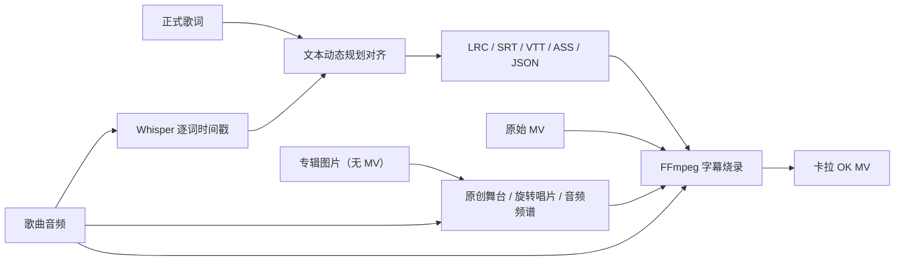

# Karaoke Forge

把一首歌、对应歌词和 MV 变成带逐词高亮的卡拉 OK 视频。所有处理都可以在本地完成，音频和视频不会被上传到第三方服务。

[English](README_EN.md) · [更新记录](CHANGELOG.md) · [待办事项](TODO.md) · [贡献指南](CONTRIBUTING.md) ·
[问题反馈](https://github.com/cf2xh123/karaoke-forge/issues)

> 当前发布版本：`0.13.0`（Alpha）。Windows 首次安装和后续启动都能在项目内自动补齐
> Python 与 FFmpeg；国内用户默认从 ModelScope 魔搭匿名直连下载识别模型，无需管理员
> 权限、系统 PATH 或代理配置。

## 能做什么

- 根据歌曲音频给无时间轴歌词生成逐词时间戳；
- 保留用户提供的正式歌词，用 Whisper 结果定位，不会直接用识别文本替换歌词；
- 提供“快速 / 均衡 / KTV 精准”三档识别；精准档会把正式歌词逐行交给
  CTranslate2 强制对齐，并只采纳通过质量检查的时间；
- ASS 扫色会保留真实首词延迟和词间停顿，不会因累加时长而让后半句越来越提前；
- 普通 LRC/SRT/VTT 可根据可靠演唱锚点自动校正固定偏移、渐进漂移和局部速度变化；
- 低置信、异常超长或缺少上下文支持的识别结果只参与文本恢复，不会直接控制成品时间；
- 读取 TXT、LRC、增强 LRC、SRT、VTT、ASS 和项目 JSON；
- 导出 LRC、增强 LRC、SRT、VTT、逐词高亮 ASS 和 JSON；
- 把字幕烧录进 MV，并可用高质量歌曲音轨替换 MV 原音轨；
- 最终导出区可分别选择原声版和 Demucs 无人声伴奏版；支持只导出其中一种或一次同时
  导出两种，双版本会复用同一次人声分离和同一份字幕画面编码；
- 没有 MV 时可使用本地或网易云/QQ 音乐专辑图，从五种背景和五种唱片/频谱布局中自由
  组合 25 种效果；默认是封面柔焦背景与居中黑胶唱片机，唱片、唱臂和唱针构成完整画面，波形会跟随真实音频变化；
- 自动定位 MV 中歌曲真正开始的位置，跳过片头或片尾剧情；
- 可从 Vmoe 取得逐字特效 ASS，或读取 UtaTen/QQ 音乐/网易云公开歌词，再按演唱速度精修；
- 未上传本地音频且 MV 没有音轨时，可一键打开 Karaoke Forge 专用的 Edge 官方登录窗口；
  日常 Edge 无需关闭，也不用 F12 或 Firefox；下次启动会后台复用仍有效的专用登录，过期后
  只在真正需要账号音频时重新打开官方登录；只获取账号有权播放的音频，不转换 NCM；
- 网易云账号即使具有 Hi-Res、母带等高阶音质权限，校准与 MV 制作也会优先下载极高、较高
  或标准音质，以改善兼容性和下载稳定性；临时网络错误会自动重试并保留安全的错误摘要；
- 在网页中逐行修正原文、翻译、时间、显示状态以及整行/逐词注音；
- 保留网易云 LRC 中带时间的空白间奏行；清空普通歌词后可直接点击 `🗑 删除`，撤销会恢复原文；
- 最终渲染前可边听当前句片段边用 ±0.1 秒微调行首/行尾，并预演当前句和下一句；
- 暂时隐藏不需要的歌词并保留恢复能力，或将错误行彻底删除；
- 由用户选择关闭、自动或强制逐字时间精修；
- 显示顶部中文翻译和左上、右下交替的传统 KTV 双行歌词；
- KTV 双行歌词逐句滚动；当前句切换时，另一行会立即更新成再下一句预告；
- 为日语汉字添加振假名、为英文单词添加片假名读音；关闭英语注音后，旧工程或在线来源
  已经保存的英文读音也不会进入最终字幕；
- 可导入 TTF、OTF、TTC 自定义字体，不安装到系统也能随工程参与字幕渲染；
- 每次制作都会保存歌词、音频、MV/封面、字体和选项为工程；重新打开时先询问继续上次工程
  还是新建空白工程，选择新建不会删除旧工程；
- 制作页会用歌曲的实际歌词预览字幕：有 MV 时叠加在对应时间的 MV 画面帧上，没有 MV 时
  使用当前专辑封面、背景主题和唱片布局；只有在线链接、音频尚未下载时也会显示完整虚拟
  MV 场景和波形布局示意，字体、字号、颜色与位置会即时更新；
- 可选用 Demucs 先分离人声，改善复杂伴奏中的识别效果；
- Windows 可自动安装并校验项目私有 FFmpeg；模型下载默认优先使用 ModelScope 魔搭国内
  直连，并保留 Hugging Face 官方源、本机代理、明确选择的第三方镜像、离线缓存和预下载；
- Windows、macOS、Linux 均可使用。

## 工作流程



Whisper 只负责找出“唱到什么位置”；最终画面仍使用你提供的歌词。对齐算法的说明见 [docs/algorithm.md](docs/algorithm.md)。

推荐使用“一次上传、两阶段制作”：在“制作卡拉 OK MV”页上传 MV，或上传歌曲音频与
专辑图片来制作无 MV 版本，再选择 Vmoe ASS、UtaTen/QQ 音乐/网易云链接或自己的歌词；
如果 MV 已含完整音轨，可以不再单独上传音频。先点
“生成可校准 KTV 工程”，
系统会基于独立音频或 MV 内嵌音轨生成/读取
时间轴、附加翻译、生成可编辑注音，并自动带入编辑器。逐句试听和微调后点击
“确认校准并开始制作 MV”，原音频和 MV/封面、字体都会保留，并自动继续渲染成片；如果
没有 MV，可选择五种唱片/频谱风格。这样既不用重复
上传素材，字幕有误时也无需反复编码 4K 视频。

选择素材后，右侧会自动显示歌曲实景字幕预览，无需先生成完整视频。有时间轴时会选取
对应歌词和画面；歌词尚未校准时会使用真实歌词进行排版示意。没有 MV 时，预览会采用
当前封面与所选唱片/频谱场景；只填写网易云链接也会先用在线封面生成该场景，待音频下载
完成后再把示意波形替换为真实音乐响应。

## 环境要求

- 手动安装时需要 Python 3.10 或更高版本，以及能从终端运行的
  [FFmpeg](https://ffmpeg.org/download.html)；
- Windows 双击安装会自动在项目内准备私有 Python 3.12.10 和固定版本的 Gyan.dev
  FFmpeg Essentials，不需要预装 Python、Conda 或 FFmpeg，也不会申请管理员权限或修改
  全局 PATH；
- 生成时间轴需要 [faster-whisper](https://github.com/SYSTRAN/faster-whisper)；
- 可选的人声分离使用 [Demucs](https://github.com/facebookresearch/demucs)。上游项目目前只做有限维护，因此它不是默认依赖。

## 不会命令行？使用网页版

Windows 用户可以完全通过双击操作：

1. 第一次使用时双击项目根目录的 **`首次安装.bat`**；脚本会从 Python 官方 NuGet 包
   下载约 14 MB 的私有运行时，并下载 FFmpeg 官网 Windows 页面列出的 Gyan.dev
   FFmpeg 8.1.2 Essentials ZIP（约 110 MB）；两者都固定版本、校验 SHA-256 并保存在
   `.runtime`，然后创建 `.venv`；Gyan 静态构建采用 GPLv3，包内保留其许可与来源说明；
2. 按向导选择模型下载方式；直接回车使用“自动测试”即可，它会先试无需账号和代理的
   ModelScope 魔搭国内直连，再试官方源和本机常见代理端口，不会自动切换到第三方镜像；
3. 安装完成后双击 **`启动网页版.bat`**；若私有 FFmpeg 被误删或安装未完成，启动脚本会
   自动重新补齐；
4. 浏览器会自动打开本地工作台；
5. 上传歌曲、MV（或专辑图片）和歌词，先生成校准工程，试听确认后再生成最终视频；下次
   启动会自动恢复最近一次工程。

模型下载向导提供以下工作方式：

- **国内直连（默认推荐）**：通过 ModelScope 魔搭匿名下载 `small`、`large-v3-turbo` 和
  `large-v3`，国内用户通常不需要登录、token 或代理；
- **自动测试**：依次测试 ModelScope 国内直连、Hugging Face 官方源和常见本机回环代理，
  选择第一个可用路径；不会自动启用第三方镜像；
- **Hugging Face 官方源**：直接连接官方服务，适合本来就能访问的网络；
- **本机代理**：保存用户确认的 HTTP/HTTPS 代理地址，供 Whisper 模型下载使用；
- **hf-mirror**：仅在用户明确选择后使用这个第三方公共镜像，不会因官方连接失败而自动
  切换，也不会把 Hugging Face token 发送给镜像；
- **离线**：完全禁止联网，只读取当前 Windows 用户的独立模型缓存。可在有网络时先让
  向导预下载“快速 / 均衡 / KTV 精准”所需模型；向导会显示缓存目录，方便按需备份。

ModelScope 上的这三份模型是公开用户上传的复本，并非原作者在魔搭完成身份认证的官方
仓库。Karaoke Forge 因此固定每个 ModelScope 提交，并把所有必需文件的准确字节数与
SHA-256 独立对照到固定的 Hugging Face 官方版本；只有逐文件校验全部通过，才会把下载结果
发布到本地缓存并交给 Whisper 加载，失败或被篡改的文件不会使用。

这些设置和模型缓存保存在当前用户的本地应用数据目录，并按下载源隔离；代理变量只
在模型加载或预下载期间临时生效，不会改浏览器或 Windows 的全局代理，也不会影响网易云
等其他请求。重新运行 **`模型下载设置.bat`** 或使用网页“环境检查与帮助”即可切换模式、
测试网络或补下模型。若不希望使用公开复本，可改用 Hugging Face 官方源、本机代理或
已经准备好的离线缓存；`hf-mirror` 仍只在明确同意后启用。

网页包含七个功能区：

- **制作卡拉 OK MV**：一次上传音频、MV/专辑图片与本地/Vmoe/UtaTen/QQ 音乐/网易云
  歌词，先生成可校准工程，确认后再渲染最终视频；无 MV 时支持五种音频响应画面，也保留
  直接生成快捷入口；
- **只生成时间轴歌词**：输出 LRC、增强 LRC、SRT、VTT、ASS 和 JSON；
- **网易云链接生成歌词**：解析原文/中文翻译 LRC，可配合本地会员音频；
- **QQ 音乐生成歌词**：读取单曲页公开的行级 LRC 和翻译，不请求歌曲音频或账号；
- **歌词与注音编辑**：逐行修正歌词、翻译、时间与注音，并隐藏或删除不需要的行；
- **歌词格式转换**：已有时间轴歌词无需 AI 模型即可转换；
- **环境检查与帮助**：查看 FFmpeg、Whisper 和可选人声分离是否就绪。

素材只会传给本机上的网页服务，默认不会发送到公网。输出保存在项目的 `outputs` 目录。

macOS/Linux 或希望手动启动的用户：

```bash
pip install -e ".[web,align,netease,pronunciation]"
karaoke-forge web
```

## 安装

克隆项目后，在项目目录创建虚拟环境：

```bash
python -m venv .venv
```

Windows PowerShell：

```powershell
.\.venv\Scripts\Activate.ps1
python -m pip install --upgrade pip
pip install -e ".[align]"
```

macOS / Linux：

```bash
source .venv/bin/activate
python -m pip install --upgrade pip
pip install -e ".[align]"
```

如需人声分离：

Windows 推荐直接双击根目录的 **“安装人声分离（Demucs）.bat”**。脚本会让你选择 CPU
版（推荐，Torch 约 120 MB）或 NVIDIA 版（另需约 1.9 GB）。CPU 版在测试机器上分离一首
218 秒歌曲约用 57 秒，通常已经够用。因此 Demucs 没有塞进“首次安装”：多数带可靠
YRC/增强 LRC 的歌曲用不到它，而显卡运行库明显更大。

也可以手动安装：

```bash
pip install -e ".[separate]"
```

首次真正分离时还会联网下载所选模型，之后会使用本机缓存。`karaoke-forge doctor` 会显示
Demucs 实际使用 NVIDIA 还是 CPU；网页的“先分离人声”旁也会显示同样状态。
最终导出无人声伴奏版同样需要 Demucs；同时选择原声版和伴奏版时只会运行一次分离。

如需同时安装本地网页和自动对齐：

```bash
pip install -e ".[web,align,netease,pronunciation]"
```

安装后检查运行环境：

```bash
karaoke-forge doctor
```

## 最快用法

准备三个文件：

- `song.flac`：正式歌曲音频，WAV/FLAC/MP3/M4A 等 FFmpeg 可读格式均可；
- `mv.mp4`：对应版本的 MV；
- `lyrics.txt`：按演唱顺序排列、一行一句的歌词。

然后运行：

```bash
karaoke-forge make song.flac mv.mp4 lyrics.txt \
  -o output/song-karaoke.mp4 \
  --language zh
```

Windows PowerShell 可写成一行：

```powershell
karaoke-forge make song.flac mv.mp4 lyrics.txt -o output/song-karaoke.mp4 --language zh
```

如需同时导出原声版和无人声伴奏版：

```bash
karaoke-forge make song.flac mv.mp4 lyrics.txt \
  -o output/song-karaoke.mp4 \
  --export-instrumental
```

如只需要无人声伴奏版，再加上 `--no-export-original`。

## 在线歌词来源

制作页把四个在线来源放在同一折叠区中：

- [Vmoe 卡拉 OK 字幕库](https://karaoke.vmoe.info/)：应用内嵌官方搜索页，也可在新窗口
  打开。该站搜索和下载必须由用户完成 reCAPTCHA；下载“特效用”或“K歌用”ASS 后，上传到
  制作页的“③ 已生成歌词/字幕项目”。Karaoke Forge 不绕过验证码；
- UtaTen：粘贴 `https://utaten.com/lyric/.../` 歌词页链接，可直接导入公开歌词和页面
  假名；也可以勾选“仅使用 UtaTen 官方注音”，保留自己歌词文件的正文和全部时间轴，
  只把能按顺序、按字符确认对应关系的 ruby 读音转移进来；不一致的文字保持无注音；
- QQ 音乐：粘贴 `y.qq.com` 或 `i.y.qq.com` 单曲链接/分享文字，可读取网页公开的行级
  LRC、歌曲信息和可用翻译；不会请求音频、账号或 Cookie；
- 网易云：可读取公开 YRC/LRC 和翻译，也保留在用户已有权限内使用本地登录会话获取音频的
  现有流程。

只导出 QQ 音乐公开歌词时，可使用网页的“QQ 音乐生成歌词”，或运行：

```bash
karaoke-forge qqmusic \
  "https://y.qq.com/n/ryqq_v2/songDetail/001gQnW91BEDaN" \
  --i-have-rights \
  -o build/qqmusic
```

QQ 音乐只提供行级时间时，可以把导出的 LRC/JSON 与本地音频放到制作页，让 Whisper 继续
精修逐字时间。自己上传或粘贴的歌词始终优先于在线页面歌词。

只导入 UtaTen 的纯文本歌词和带假名项目 JSON 时，可运行：

```bash
karaoke-forge utaten \
  "https://utaten.com/lyric/yh15042710/" \
  --i-have-rights \
  -o build/utaten
```

UtaTen 页面不提供时间轴，因此制作页会结合上传的歌曲音频或 MV 音轨生成逐字时间。
如果已经有自己的歌词或编辑工程，可在制作页上传该文件并勾选“仅使用 UtaTen 官方注音”。
该模式会先清除文件中原有注音，再按顺序匹配相似歌词行并逐字符核对 ruby；自己的正文、
翻译、行时间和逐字时间都不会被 UtaTen 覆盖。找不到可靠对应关系的片段不会自动猜读音。

“自动生成英语片假名”是独立开关。关闭它只会阻止程序自动给英文单词注音，不影响日语
振假名，也不删除手动填写、项目已有或 UtaTen 官方提供的注音。命令行输出 ASS 时可使用
`--no-auto-english-pronunciation`。

## 网易云单曲链接

网页版的“一键制作 MV”支持用网易云链接补充素材：

- 已上传本地音频时，只读取公开的歌曲信息和 LRC，不请求网易云音频；
- 没有独立音频但 MV 含完整音轨时，会直接使用 MV 音轨，也只读取网易云公开信息和歌词；
- 独立音频和 MV 音轨都没有时，才尝试获取匿名用户也能公开播放的音频；
- 平台只返回 30 秒试听、但上传的 MV 带完整音轨时，会自动改用 MV 内嵌音频；
- Windows 网页版可点击“一键登录网易云”，程序会打开使用独立本机配置的专用 Edge 小窗口，
  并进入网易云官网；完成官网登录后会自动取得本次制作所需的会话；
- 专用窗口不会读取日常 Edge 的配置或被占用的 Cookie 数据库，因此日常 Edge 可以继续开启，
  也无需使用 F12、安装 Firefox 或自己查找 Cookie；
- 专用 Edge 登录态保存在本机独立 profile 中，通常首次登录后即可复用；自动读取已退出的
  Chrome/Edge/Firefox/Brave，以及手动填写 `MUSIC_U`，保留在高级设置中作为备用方式；
- 自动取得的会话只保存在当前本机网页会话的服务端状态，不会回填到浏览器密码框；登录
  失效或需要换账号时，可直接点击“重新登录”；远程监听模式不会开放本机账号与浏览器数据；
- 没有上传歌词时，可以直接采用网易云页面原文和中文翻译 LRC；
- 自己上传或粘贴的歌词始终优先于页面歌词。

MV 文件可能较大，可在网页“高级设置”中把输出目录改到空间充足的磁盘；建议至少预留
2 GB。若 FFmpeg 遇到磁盘空间不足，本次生成的残缺视频会自动清理。网页预览缓存默认
位于输出目录同盘的 `KaraokeForgeCache`，不会再次占用系统盘。

会员歌曲可以直接点击网页中的“一键登录网易云”，在程序打开的专用 Edge 小窗口完成官网
登录。这个窗口与日常 Edge 相互隔离，日常浏览器无需退出；手动粘贴 `MUSIC_U` 仅作为高级
备用方式。也可以在网易云官方客户端中按平台许可导出标准 MP3、FLAC、WAV 或 M4A 后上传。
本项目：

- 不接收账号或密码；一键登录过程只发生在网易云官网，登录态由专用 Edge profile 保存在
  本机；程序取得的 Cookie 不回填网页，也不写入项目、输出目录或日志；
- 手动提供的 `MUSIC_U` 只在本机内存中按需使用，不会保存到工程；
- 只使用当前账号本来具有的播放和音质权限，不提升或模拟会员身份；
- 不绕过地区、版权或 DRM 限制；
- 不转换或解密 `.ncm` 文件。

只生成时间轴歌词时，可以使用网页的“网易云链接生成歌词”，也可以运行：

```bash
karaoke-forge netease "https://music.163.com/song?id=123456" lyrics.txt \
  --cookies-from-browser edge \
  --i-have-rights \
  -o build/netease
```

浏览器中需要已经登录 `music.163.com`；非默认配置可加
`--browser-profile "Profile 1"`。程序会记录检测到的登录状态、该曲最高可用音质以及
VIP/SVIP 权限，但不会打印或保存 Cookie。省略 `lyrics.txt` 会优先使用页面公开的 YRC
逐字时间歌词，没有 YRC 时再回退到 LRC；
同时省略 `--audio` 和 `--cookies-from-browser` 时会尝试匿名公开音频。
YRC 中每个字的真实开始时间和持续时间会直接用于扫色，能处理拖长音、抢拍和句中速度
变化。普通 LRC/SRT 只有行级时间时，默认用音频识别结果精修句内逐字时间，同时固定原有
行首和行尾，避免整句漂移。网页和命令行统一提供三种策略：

- `off`：完全保留输入时间；
- `auto`：只精修普通 LRC/SRT 等合成逐字时间，保留 YRC/增强 LRC 的可信时间；如果
  Whisper 模型暂时无法下载或识别失败，会保留原时间轴继续，不中断制作；
- `force`：即使已有真实逐字时间也重新根据演唱音频检查，但只采纳高可靠且不会大幅偏离
  YRC/人工时间的句内修正；低质量识别会保留原时间。

识别模型可以直接选择三档预设；网页默认使用“均衡”，命令行分别传入
`--model profile:fast|profile:balanced|profile:precise`：

| 档位 | 实际配置 | 适合场景 |
| --- | --- | --- |
| 快速 | `small`，beam 3 | 先生成可编辑工程、CPU 或较慢的电脑 |
| 均衡（默认） | `large-v3-turbo`，beam 5 | 大多数歌曲的速度与准确率平衡 |
| KTV 精准 | `large-v3`，beam 5 | 自动尝试 Demucs 人声轨，再用正式歌词逐行执行 CTranslate2 强制对齐 |

KTV 精准把 Demucs 当作“优先尝试”：没有安装、运行失败或当前工作流不能分离时，会明确
提示并改用原音频继续；某一行强制对齐失败或没有通过质量门时，也只保留该行的 0.12
粗对齐结果，不影响其他行。手动勾选“先分离人声”仍是严格要求——此时 Demucs 不可用
会直接报错，不会静默回退。`auto` 依然不会改动已有真实逐字时间的 YRC/增强 LRC；只有
选择 `force` 才会检查这些来源时间。

`align`、`make`、`netease` 命令使用
`--timing-refinement off|auto|force`；旧版
`--no-refine-word-timing` 仍作为兼容参数保留。

制作 MV 时默认启用音轨指纹匹配。它从歌曲和 MV 内嵌音轨提取多个短窗口，只有多个
窗口以同一偏移量稳定匹配时才接受结果，因此可以跳过片头/片尾剧情，也能阻止错误歌曲
和错误 MV 继续生成。命令行使用 `karaoke-forge make ... --auto-sync` 开启。

输出包括：

```text
output/
├── song-karaoke.mp4
├── song-karaoke-instrumental.mp4  # 选择无人声伴奏版时生成
└── song-karaoke.assets/
    ├── song-karaoke.lrc
    ├── song-karaoke.enhanced.lrc
    ├── song-karaoke.srt
    ├── song-karaoke.vtt
    ├── song-karaoke.ass
    └── song-karaoke.json
```

第一次运行会下载所选 Whisper 模型；默认“均衡”的 `large-v3-turbo` 和 KTV 精准的
`large-v3` 体积明显大于快速档，首次下载和加载可能需要较长时间，之后会优先复用当前
用户按下载源隔离的独立缓存。Windows 默认优先从 ModelScope 国内节点匿名直连；也可重新
运行模型下载向导，切换到 Hugging Face 官方源、自动探测到的本机代理，或在明确同意后
使用 `hf-mirror`，还可以提前下载后切换为离线模式。第三方镜像不会自动启用，程序也不会
向它发送 Hugging Face token。若暂时不下载模型，可先改用已有时间轴，或把“逐字时间精修”
设为“关闭”。

## 歌词与注音编辑

网页的“歌词与注音编辑”可以载入 LRC、YRC、SRT、VTT、ASS 或 Karaoke Forge JSON：

1. 推荐从制作页点“生成可校准 KTV 工程”，音频、歌词、翻译和自动注音会直接带入；
2. 打开“歌词总览”后，右键任意一行可以隐藏/显示、在上方或下方插入新行、删除；误操作可撤销；
3. 试听时可以开启“循环当前句”反复微调，关闭后唱完会自动播放下一句，并支持
   0.5×–2× 倍速；焦点不在输入框时，按空格可暂停或继续；
4. 直接点击歌词表格中的任意一行，自动精确截取并播放该句；片段播放完毕后由播放器
   原生循环，或触发下一句自动播放；
5. 在音频下方的逐词时间条中直接修改文字；右键词块可删除多余字或空格，词块会立即
   消失并自动保存，其他词的开始/结束时间不会变化；点击词块空白处可试听单词；
6. 拖动黄色边界调整每个词自己的开始/结束时间；拖动红色播放头可直接跳到对应时间；
   可撤销/重做，KTV 预览会随播放实时扫色；
   长句播放时会自动跟随当前词，也可用“缩小 / 适应全句 / 放大”查看短字细节，
   或用“前一段/后一段”快速翻动；鼠标停在时间轴上按 `Ctrl + 滚轮` 可直接缩放，
   放大后按住空白区域左右拖动即可平移时间轴；
7. 需要整体移动句子时，也可以使用 ±0.1 秒按钮微调开始/结束时间；
8. 在主表格中修改开始/结束秒、原文和翻译；
9. 点击“打开歌词总览”会从左侧滑出歌词抽屉；点击序号会选中、试听并自动收起，
   点击其他单元格则可留在抽屉中继续编辑；
   右键菜单和右侧“当前句操作”都能完成隐藏/显示或删除；
10. 隐藏行会保留在 JSON 中但不进入其他字幕或视频；删除则从导出项目中彻底移除；
11. 载入当前行注音，可修改整行读音或逐词读音表格；
12. 确认后交回制作页；原音频和 MV 保持不变，直接开始最终渲染。

逐词或注音修改尚未点“保存”时若歌曲自动进入下一句，编辑器会先保存本句并建立撤销快照；
随后点击“撤销 / 重做”会回到发生修改的句子。没有可撤销内容时只会给出提示。当前句
播放期间还会后台预热下一句试听片段，减少自动切句停顿；插入、删除歌词行或微调句首尾
后，试听片段会按新的当前范围自动刷新。

编辑器采用固定满屏工作台，不依赖网页上下滚动：顶部工具栏、KTV 预览、音频波形、
逐词时间轴、当前句操作和注音区同时保持在一个视口中。鼠标停在 KTV 预览上按
`Ctrl + 滚轮` 可缩放歌词字号；在歌词总览和时间轴上使用相同操作，会分别缩放列表
字号和时间轴精度。顶部按钮可随时打开歌词总览抽屉。

删除或隐藏整行时，原文、翻译、注音和逐字时间作为一个整体处理；剩余可见歌词会重新
组成 KTV 上下双行。建议保留导出的 JSON 作为可恢复项目文件。修改原文后，编辑器会按
当前行时长重新生成与新文本一致的逐字边界；只修改行首/行尾则会等比例缩放原边界。

## 分步使用

### 1. 只生成时间轴歌词

```bash
karaoke-forge align song.flac lyrics.txt \
  -o build/song \
  --language zh \
  --model small
```

伴奏很密、识别覆盖率较低时，可以先分离人声：

```bash
karaoke-forge align song.flac lyrics.txt \
  -o build/song \
  --language zh \
  --separate-vocals
```

CPU 可尝试：

```bash
karaoke-forge align song.flac lyrics.txt \
  -o build/song \
  --device cpu \
  --compute-type int8
```

NVIDIA GPU 可尝试：

```bash
karaoke-forge align song.flac lyrics.txt \
  -o build/song \
  --device cuda \
  --compute-type float16 \
  --model medium
```

### 2. 把已有时间轴歌词转换格式

```bash
karaoke-forge convert lyrics.lrc -o lyrics.srt
karaoke-forge convert lyrics.srt -o lyrics.ass
karaoke-forge convert lyrics.json -o lyrics.enhanced.lrc --format elrc
```

### 3. 把字幕烧录进 MV

保留 MV 自带音轨：

```bash
karaoke-forge render mv.mp4 lyrics.ass -o karaoke.mp4
```

替换为正式歌曲音轨：

```bash
karaoke-forge render mv.mp4 lyrics.ass \
  --audio song.flac \
  -o karaoke.mp4
```

如果歌曲音轨比 MV 画面晚 0.35 秒开始：

```bash
karaoke-forge render mv.mp4 lyrics.ass \
  --audio song.flac \
  --audio-offset 0.35 \
  -o karaoke.mp4
```

负数会让歌曲音轨提前。输出已存在时需明确传入 `--overwrite`。

## 字幕样式

`align`、`render` 和 `make` 都支持同一组样式参数：

```bash
karaoke-forge make song.flac mv.mp4 lyrics.txt \
  -o karaoke.mp4 \
  --auto-sync \
  --font "Noto Sans CJK SC" \
  --font-size 64 \
  --text-color "#FFFFFF" \
  --highlight-color "#FFD54A" \
  --outline-color "#111111" \
  --margin-v 80 \
  --translation-font-size 38 \
  --translation-color "#EAF4FF" \
  --pronunciation-font-size 26 \
  --pronunciation-color "#FFFFFF" \
  --resolution 1920x1080
```

当歌词包含中文翻译时，ASS 会采用传统 KTV 分区布局：中文翻译固定在画面顶部居中，
原文在底部按“左上行 + 右下行”成对显示，当前句逐字变色，另一句保持未唱颜色。
可用 `--no-show-translation` 关闭翻译。网页版样式区域会随当前歌曲素材实时更新预览，
最终 ASS 仍使用相同的字幕参数。

默认还会为含汉字的日语歌词生成平假名振假名，并为英语单词生成片假名读音；
注音位于对应原文行上方，并跟随当前句逐段变色。可在网页中调整注音字号和颜色，
或用 `--no-show-pronunciation` 关闭。自动读音可能遇到人名、造词或多音词，
需要时可在网页“歌词与注音编辑”中逐行、逐词修正；高级用户仍可直接修改歌词 JSON
的 `pronunciation` 或 `pronunciation_units` 字段。

字体必须已经安装在运行 FFmpeg 的系统中。不同平台可优先选择：

- Windows：`Microsoft YaHei`；
- macOS：`PingFang SC`；
- Linux：`Noto Sans CJK SC`。

## 支持的歌词格式

| 格式 | 读取 | 导出 | 逐词时间 |
|---|:---:|:---:|:---:|
| TXT | ✓ | — | 无，需对齐 |
| LRC | ✓ | ✓ | 行级 |
| 增强 LRC | ✓ | ✓ | ✓ |
| SRT | ✓ | ✓ | 自动均分到词 |
| WebVTT | ✓ | ✓ | 自动均分到词 |
| ASS | ✓ | ✓ | 导出时为 `\kf` 高亮 |
| Karaoke Forge JSON | ✓ | ✓ | ✓，保留置信度 |

详细格式约定见 [docs/formats.md](docs/formats.md)。

## 提高时间轴准确率

1. 歌词必须与音频是同一版本；录音室版、现场版和重制版不能混用。
2. 删除歌词中的段落名，如 `[Verse]`、`【副歌】`；本项目会自动忽略常见方括号段落名。
3. 明确传入语言，例如中文用 `--language zh`，日语用 `--language ja`。
4. 先用 `small` 试跑；咬字复杂时再换 `medium` 或更大模型。
5. 复杂伴奏导致识别漏字、覆盖率低时，再安装 Demucs 并使用 `--separate-vocals`；已有
   可靠网易云 YRC/增强 LRC 时通常无需分离。
6. 最后用 Aegisub、Subtitle Edit 或文本编辑器微调导出的 ASS/增强 LRC。

终端会打印匹配覆盖率。覆盖率高只代表歌词字词找到了对应位置，不等于每个音节都达到录音棚级精度。
网页版校准在覆盖率低于安全阈值时仍会生成可编辑工程：有匹配锚点时继续插值，完全没有
匹配时按检测到的演唱区间生成保底时间轴，并列出未匹配歌词、实际语言、模型和人声分离
建议。这个时间轴用于恢复和人工校准，不应在未试听确认前直接作为最终成品。

## 更新项目

从 Git 仓库安装的用户：

```bash
git pull --ff-only
python -m pip install --upgrade -e ".[web,align,netease,pronunciation]"
karaoke-forge doctor
```

Windows 用户双击 `启动网页版.bat` 时，如果旧安装缺少网易云一键登录组件，启动器会使用
现有 `.venv` 自动补装 `.[web,netease]`，无需重新运行首次安装。

安装了人声分离依赖时，再运行一次“安装人声分离（Demucs）.bat”或安装 `.[separate]`。
升级前请看 [CHANGELOG.md](CHANGELOG.md)，其中会标注破坏性变更和迁移方式。

维护者或测试人员可用真实本机素材完整验证编辑流程，不会覆盖原文件：

```powershell
.\.venv\Scripts\python.exe scripts\verify_editor_workflow.py 歌词项目.json 歌曲音频.m4a
```

网页版正在运行时，还可以从另一个终端验证真实 Gradio 会话：

```powershell
.\.venv\Scripts\python.exe scripts\verify_web_session.py 歌词项目.json 歌曲音频.m4a
```

未来若发布到 PyPI，可使用：

```bash
python -m pip install --upgrade "karaoke-forge[align]"
```

维护者发布新版本时需要同时更新：

1. `pyproject.toml`、`src/karaoke_forge/__init__.py` 和 `projects.py` 中的版本；
2. 中英文 README、`CHANGELOG.md` 和 `TODO.md`；
3. 用 `rg "Karaoke-Forge/" src` 检查各网络请求的 User-Agent 版本；
4. 运行全量测试并构建 wheel，确认包名中的版本正确；
5. 打 Git 标签并创建 GitHub Release。

## 开源前检查

- 在 `pyproject.toml` 增加真实的 `Homepage` 和 `Issues` 地址；
- 将仓库名、作者信息和联系方式改成你的实际信息；
- 确认歌曲、歌词、MV、字体和示例素材具有分发授权；
- 不要把模型缓存、私人媒体和生成视频提交到 Git；
- 在 GitHub 设置中启用 Actions，并按需开启 Issues/Discussions；
- 用 `python -m pytest` 和一次真实 MV 试跑验证发布版本。

项目代码采用 [MIT License](LICENSE)。这不授予任何歌曲、歌词、MV、字体或模型权利；发布生成内容前请自行确认所在地法律和平台规则。

## 开发

```bash
pip install -e ".[dev]"
python -m pytest
ruff check src tests
```

项目结构：

```text
src/karaoke_forge/
├── align.py       # 正式歌词与 ASR 单词的动态规划对齐
├── formats.py     # 歌词格式读写
├── ass.py         # 逐词高亮 ASS 生成
├── transcribe.py  # faster-whisper 后端
├── media.py       # FFmpeg 与 Demucs 调用
├── pipeline.py    # 工作流组合
├── workflows.py   # CLI 与网页共用的一键制作流程
├── web.py         # 本地可视化工作台
└── cli.py         # 命令行界面
```

欢迎查看 [CONTRIBUTING.md](CONTRIBUTING.md) 后提交 Issue 或 Pull Request。
